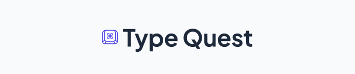

# TypeQuest 🚅

A simple website that puts your typing speed to test.

## 🚀 features

- minimalistic design
- live errors, wpm, and accuracy displays
- a variety of test lengths and languages
- punctuation and numbers modes
- themes

## 📦 Want to contribute?

### clone this repo

```bash
git clone https://github.com/BrinsilElias/type-quest
```

### instal dependencies

```bash
cd type-quest
```

```bash
npm i
```

### spin up local dev server

```bash
npm run dev
```

### build to `./dist/`

```bash
npm run build
```

### preview production build

```bash
npm run preview
```

---

## 🎊 credits

greater minds than mine are behind the inspiration for building this site, I'd like to mention those projects

- [monkeytype.com](https://monkeytype.com)
- [typings.gg](https://typings.gg)
- [typetest.io](https://typetest.io)

I hope you find this tool useful! 🌟

Made with ❤️ by [Brinsil](https://www.github.com/BrinsilElias).
